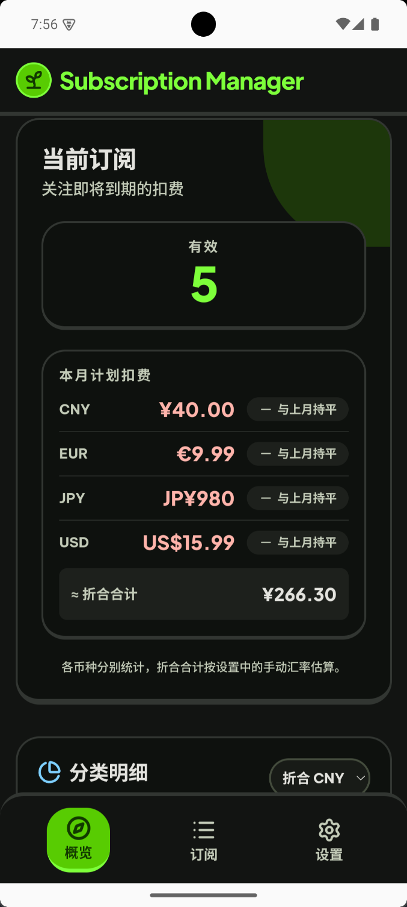
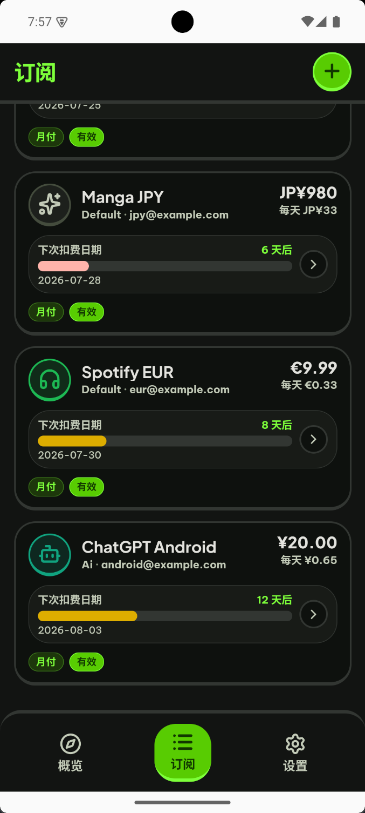
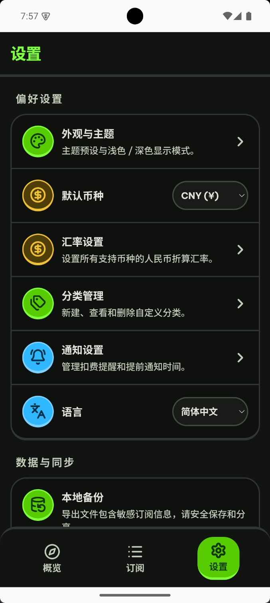

# Subscription Manager

A local-first subscription manager for Android.  
No account required. No cloud backend required. Your data stays on your device by default.

[中文说明](./README.md)

## What it is

**Subscription Manager** (internal codename SubScout) helps you:

- Track monthly and yearly subscriptions
- Understand this month's spend and category mix
- Get reminded before billing dates
- Use the full core flow offline

The product goal is simple: privacy-friendly, low-ops, and fast to install.

## Screenshots

<p align="center">
  
  
  
</p>

| Overview | Subscriptions | Settings |
| --- | --- | --- |
| Active count, planned spend, multi-currency totals | Cards with next billing countdown | Theme, rates, categories, reminders, backup |


## Features

- **Subscription management**: create, edit, cancel, and restore subscriptions
- **Billing cycles**: monthly and yearly renewals
- **Home overview**: active count, monthly spend, category donut
- **Multi-currency**: manual exchange rates with optional CNY totals on home
- **Local reminders**: device local notifications with configurable lead days
- **Appearance themes**: Scout / Ocean / Coral / Graphite, plus light / dark / system
- **Languages**: Chinese / English
- **Backup & restore**: local export / import for MVP resilience

## Tech stack

| Layer | Stack |
| --- | --- |
| UI | Vue 3 + TypeScript + Tailwind CSS |
| Routing / state | Vue Router + Pinia |
| Native shell | Capacitor 8 |
| Local database | SQLite (`@capacitor-community/sqlite`) |
| Local notifications | `@capacitor/local-notifications` |
| Tests | Vitest + Vue Test Utils |

## Project layout

```text
Subscription_manager/
├── README.md                 # Chinese README (default)
├── README.en.md              # English README
├── docs/screenshots/         # App screenshots
├── .scratch/                 # Specs and issue drafts
└── mobile/                   # App source
    ├── android/              # Capacitor Android project
    ├── src/
    │   ├── application/      # Application services
    │   ├── domain/           # Domain logic
    │   ├── database/         # SQLite access
    │   ├── notifications/    # Notification adapter
    │   ├── views/            # Screens
    │   └── components/       # UI components
    ├── package.json
    └── capacitor.config.ts
```

## Getting started

### Requirements

- Node.js `^22.18.0` or `>=24.12.0`
- npm
- Android Studio / Android SDK for packaging
- Optional: Android emulator or a physical device

### Install

```bash
cd mobile
npm install
```

### Web development

```bash
cd mobile
npm run dev
```

### Type-check / test / build

```bash
cd mobile
npm run type-check
npm run test:unit
npm run build
```

### Sync and build Android

```bash
cd mobile
npm run build-only
npx cap sync android
cd android
# Windows example
set JAVA_HOME=C:\Program Files\Android\Android Studio\jbr
gradlew.bat assembleDebug
```

Debug APK output:

```text
mobile/android/app/build/outputs/apk/debug/app-debug.apk
```

### Install on device / emulator

```bash
adb install -r mobile/android/app/build/outputs/apk/debug/app-debug.apk
adb shell monkey -p com.subscout.app -c android.intent.category.LAUNCHER 1
```

App ID: `com.subscout.app`  
Display name: `Subscription Manager`

## Product principles

1. **Local-first**: core data and reminders stay on-device by default
2. **Offline-capable**: tracking, stats, and reminder scheduling work without network
3. **Privacy-friendly**: no forced signup, no default upload of spending habits
4. **Clean seams**: UI, domain math, persistence, and notification adapters stay separate so future sync can land without rewriting screens

## Current status

This repository is a working Android MVP:

- Subscription lifecycle, home stats, local reminders, themes, and language are in place
- Debug packages can be installed on emulator / device
- iOS packaging needs macOS / Xcode; Android is the primary verification path

## Development notes

- Specs and split issues live under `.scratch/mobile-subscription-manager/`
- Keep domain logic in `mobile/src/domain`
- Keep persistence in `mobile/src/database` and `mobile/src/application`
- Notifications go through an adapter so tests can use an in-memory implementation

## License

No open-source license has been declared yet. Add a `LICENSE` before publishing publicly if needed.
